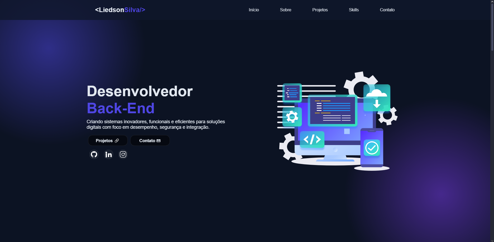

# Portfólio

## 📋 Descrição

Portfólio pessoal desenvolvido para apresentar minhas habilidades, projetos e formas de contato.  
O site contém informações sobre mim, minhas tecnologias dominadas e exemplos de trabalhos realizados, servindo como vitrine profissional para oportunidades na área de desenvolvimento.

## 🛠️ Tecnologias

- HTML  
- CSS  
- JavaScript

## 🌍 Acesse o projeto

Você pode acessar o portfólio clicando no link abaixo:  
👉 [Portfólio](https://liedson.vercel.app)

## Imagem do projeto

